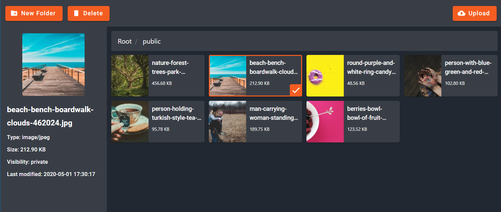

# Media - Explore, Upload, Delete and Create new folder

You can use this package to upload your media and attach the media to your models.

| Version | Laravel |
|---------|---------|
| ^1.0.0  | ^10.7   |

# Installation

1. `composer require ar7/media`.
2. add `Ar7\Media\MediaServiceProvider::class` to `providers` array inside `config/app.php`.
3. add `'Ar7Media' => Ar7\Media\Facades\Ar7Media::class` to `aliases` array inside `config/app.php`.
4. add `"Ar7\\Media\\": "vendor/ar7/media/src/"` to `autoload => psr-4` object inside `composer.json` file,
   then run this command: `composer dump-autoload`.
5. If you haven't link your storage, please run this command `php artisan storage:link`.
6. run `php artisan vendor:publish --tag=ar7-media-config` to copy the config file into `config` folder.
7. run `php artisan vendor:publish --tag=ar7-media-public` to copy asset files into `public` folder, running this
   command with `--force` flag is recommended.
8. run `php artisan vendor:publish --tag=ar7-media-migrations` to copy the migrations into `database/migrations`
   folder.
9. run `php artisan migrate` to create the tables.

# API

You can use these methods on your model:

| Method          | Parameters              | Description                                                                                           | Example                                                            |
|-----------------|-------------------------|-------------------------------------------------------------------------------------------------------|--------------------------------------------------------------------|
| addMedia        | $paths - (Single-Array) | Add media to your model                                                                               | `User::findOrFail(1)->addMedia([$request->input('image')])`        |
| updateMedia     | $paths - (Array)        | Update media for your model                                                                           | `User::findOrFail(1)->updateMedia([$request->input('image')])`     |
| removeMedia     | $name - (Single-Array)  | Remove media from your model                                                                          | `User::findOrFail(1)->removeMedia('image')`                        |
| getMedia        | -                       | Return all the media for your model                                                                   | `$media = User::findOrFail(1)->getMedia()`                         |
| getMediaByName  | $pattern (String)       | Return all the media that has a name with the provided pattern                                        | `$media = User::findOrFail(1)->getMediaByName('/(extra_images)/')` |
| getMedium       | $id - (Integer)         | Get a single medium of your model with an id, If id is empty it will return the first medium          | `$medium = User::findOrFail(1)->getMedium(2)`                      |
| getMediumByName | $name - (Single-Array)  | Get a single medium of your model with the name, If the name is empty it will return the first medium | `$medium = User::findOrFail(1)->getMediumByName('image')`          |

There is a `getSubSize` method for a single medium which you can get a specific subSize (that you defined in the config
file) of an image, using below code:

```php
$medium->getSubSize('thumbnail');
```

# Usage

First, take A look at the `ar7_media.php` file in `config` folder.

Add `Ar7Media` to your model

```php
use Ar7\Media\Ar7Media;

class Product extends Model
{
    ...
    use Ar7Media;
    ...
}
```

In your view you have to load the css and js files and load the media selector:

### Example:

```html
<!doctype html>
<html lang="en">
<head>
	<meta charset="UTF-8">
	<title>Ar7 Media</title>
	<!-- load the css file -->
	@ar7_media('css')
</head>
<body>
<form method="post">
	@csrf
	<!-- load the media selector -->
	@ar7_media_start
	@ar7_media_file('img', '{"name": "image", "placeholder": "Image", "file": ""}')
	@ar7_media_end
	<!-- load the media selector -->
	<br>
	<button type="submit">Submit</button>
</form>

<!-- load the js files -->
@ar7_media('js')
</body>
</html>
```

The `@ar7_media_file` directive has two parameters:

1. ID - for the media selector
2. OPTIONS - A JSON object with these keys:

```json5
{
  "name": "(String)",
  // the key which you can get in $request object when the form submitted
  "placeholder": "(String)",
  // placeholder for the media selector
  "file": "(String)",
  // Current media path to show in media selector
  "id": "(Number)"
  // Current media id
}
```

## Upload from controller

To upload a file from controller simply use the `Ar7Media` facade.

```php
use Ar7\Media\Facades\Ar7Media;

class HomeController
{
    function index()
    {
        $file = $request->file('file');
        Ar7Media::upload($file, 'path'); // path is optional
    }
}
```

## Load with JS

If you want to load the selector with javascript use the instruction below:

add this inside or outside the media selector blade directives.

```html
@ar7_media_start
<div id="mp3"></div>
@ar7_media_end

<!-- OR -->

<div id="mp3"></div>
```

then load the selector with this code

```js
Ar7Media.loadMediaSelectorWithJS('mp3', {name: 'mp3', placeholder: 'MP3', accept: '.mp3'});
```

The parameters of `loadMediaSelectorWithJS` method are exactly like `@ar7_media_file` directive. It only has a
third parameter that get `true` or `false`. you should pass `false` if you want to add that `div` element outside the
media selector blade directives.

## Integrations

### CKEditor

In your view add a textarea:

```html
<textarea name="editor1"></textarea>
```

Use media as CKEditor file browser:

```javascript
CKEDITOR.replace('editor1', {
	filebrowserBrowseUrl: mediaRoute('ar7.media.index'),
	filebrowserImageBrowseUrl: mediaRoute('ar7.media.index') + '?accept={{ config("ar7_media.mime_types.image/*") }}',
});
```
